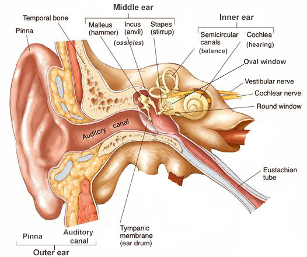

+++
title = "Sound and hearing"
outputs = ["Reveal"]
[reveal_hugo]
theme = "moon"
margin = 0.2
separator = "##"
+++

## Introduction to Sound and Hearing

### What You'll Learn
- Basics of sound: amplitude, frequency, phase, and harmonics
- How the ear processes sound
- Introduction to psychoacoustics: How we perceive sound
- Practical implications for audio production

### Why It Matters
Understanding sound and hearing is foundational for anyone working in audio production, from recording and mixing to synthesis and sound design.

{}
This slide sets the stage for the presentation by outlining what students will learn and why it's important. Emphasize that these fundamentals will be referenced throughout their studies and careers.
{}

---

## Sound areas

- The basics of sound
- The characteristics of the ear
- How a sound stimulates the ear
- The psychoacoustics of hearing

---

The Transducer

device -> energy conversion -> resulting energy

{}
ex:
guitar - vibrations -> amplified by wood -> converted into sound pressure waves that we perceive as sound

What types of devices could be considered transducers?

- microphone
- etc

{}

---

---

## The basics of sound

{}
Sound arrives at the ear as periodic variations in atmospheric pressure called sound-pressure waves. This atmospheric pressure is the same as the weather service measures. The changes in pressure heard by the ear are too small in magnitude and fluctuate too rapidly to be observed on a barometer.

It is sort of like when you pop a balloon!

{}

---

{}
Any vibrating mass, such as the voice or guitar, causes compression and rarefaction creating areas of high and low-pressure states. These pressure states move the sound wave out from the source, allowing us to hear it.

This diagram is helpful, but this is not usually how we visualize sound. We do it with a waveform, a graphic representation of the sound-pressure level. Looking at the waveform, we can tell if the sound is quiet or loud and sometimes the frequency of the sound.
{}

---

## Understanding Amplitude

### Key Concepts
- Amplitude measures the strength or intensity of a sound wave.
- It directly relates to perceived loudness.

{}
Introduce the concept of amplitude here. Stress that amplitude is a fundamental aspect of how we perceive sound, and it directly affects the loudness we hear.
{}

---

## Amplitude

{}
The distance above or below the centerline of a waveform (such as a pure sine wave) represents the amplitude level of that signal. The greater the distance or displacement from that centerline, the more intense the pressure variation, electrical signal level or physical displacement will be within a medium.
{}

---

## Amplitude in the Real World

- **Example:** Think about the difference in loudness between a whisper and a shout.
- **Interactive Example** [amplitude](https://contrib.pbslearningmedia.org/WGBH/buac20/buac20-int-wavesamplitude/index.html)
- **Tip:** When recording, always monitor amplitude levels to avoid distortion.

{}
Use this slide to connect the concept of amplitude to everyday experiences. Play the sound clip and ask students to describe what they hear. Reinforce the importance of monitoring levels in recording.
{}

---

## Understanding Frequency

### Key Concepts
- Frequency refers to the number of cycles per second in a sound wave.
- It determines the pitch of the sound.

{}
Transition into the concept of frequency. Explain that frequency is crucial for understanding pitch, which is another fundamental aspect of sound.

The rate at which an acoustic generator, electrical signal, or vibrating mass repeats within a cycle of positive and negative amplitude is known as the frequency of that signal.

We can also measure a frequency in cycles per second; (Hz) or hertz (Hz). An "A" note is 440 Hz.
{}

---

## Frequency in Action

- **Example:** A bass note versus a high-pitched whistle.
- **Interactive Example** [frequency](https://contrib.pbslearningmedia.org/WGBH/buac20/buac20-int-wavesfreq/index.html)
- **Tip:** Different frequencies interact in complex ways in a mix. 

{}
Play the sound clip and discuss how low and high frequencies differ in sound. Highlight the importance of understanding frequency when working with EQ and other audio tools.
{}

---

## Phase Relationships

- **Key Concept:** Phase refers to the timing relationship between two sound waves.
- **Impact:** Out-of-phase waves can cancel each other out, leading to a reduction in sound.
- **Sound Demo:** [Phase](https://youtu.be/bc1Z1ck9hKQ)

{}
Discuss the concept of phase, emphasizing how out-of-phase signals can lead to issues like phase cancellation. Use the demo to show this effect in practice.
{}

---

[Random phases - square and sawtooth](https://tomasboril.cz/fourierseries3d/en/)

---

## Harmonic Content

- **Key Concept:** Harmonics are additional frequencies in a sound that define its timbre.
- **Real-World Example:** Why a guitar and piano sound different, even when playing the same note.
- **Sound Clips:** [Fourier Series 3D interactive demonstration](https://tomasboril.cz/fourierseries3d/en/)
  
{}
Explain harmonics and how they contribute to the unique sound of different instruments. Use the sound clips to demonstrate these differences in timbre.

Most real life sounds are much more complex than a sine wave.

The factor that helps us differentiate between instrumental “voicings” is the presence of frequencies (called partials) that exist in addition to the fundamental pitch that’s being played. Partials that are higher than the fundamental frequency are called upper partials or overtones. If the overtones are whole-number multiples of the fundamental frequency, they are called harmonics.

Harmonics also form the basis of synthesis.
{}

---

# The Decibel

{}
Variations in sound pressure level or SPL and is measured on a logarithmic scale in decibels (dB).
{}

---

# The Ear

{}
* Sound is collected by the pinna. 
* Then it travels through the eardrum, which vibrates, converting sound-pressure waves into mechanical vibrations. 
* The sound then goes to the cochlea, this snail looking organ covered in tiny hair receptors. It is here that we perceive frequencies of a sound.
{}

---

## Introduction to Psychoacoustics

- **What Is It?** Psychoacoustics explores how our brain interprets sound.
- **Key Concepts:** Pitch perception, loudness perception, and spatial hearing.

{}
Introduce the concept of psychoacoustics and explain why it's important in audio production. Stress that this field helps us understand how listeners perceive the sounds we create.
{}

---

## Auditory Perception

{}
What sound comes into your ears is not always what you "hear"; your brain completes the picture. Our ears perception of timbre and frequency changes with the loudness of a perceived signal

This image is known as the **Fletcher-Munson curve** or **equal-loudness contour**. It’s a graph that shows how the human ear perceives loudness at different frequencies and volumes.

### Breaking It Down:

- **Horizontal Axis (X-axis):** 
  - This represents the **frequency** of a sound, measured in Hertz (Hz). The frequency ranges from low (20 Hz) to high (10,000 Hz). Lower frequencies are bass sounds, while higher frequencies are treble sounds.

- **Vertical Axis (Y-axis):**
  - This represents the **sound pressure level (SPL)** in decibels (dB SPL), which is a measure of how loud a sound is.

- **Curves on the Graph:**
  - Each curve shows the ear’s sensitivity to different frequencies at various loudness levels. 
  - The numbers on the right represent **loudness levels** in phons, which correspond to the perceived loudness of a 1,000 Hz tone at different decibel levels.
  - For example, the 60-phon curve means that all the frequencies on that line sound equally loud to our ears as a 1,000 Hz tone at 60 dB SPL.

### Key Points:

- **Threshold of Hearing:** 
  - The dotted line near the bottom represents the quietest sound that the average human ear can hear at each frequency. This is known as the **threshold of hearing**.

- **Sensitivity Variation:** 
  - The ear is most sensitive to frequencies between **1,000 and 5,000 Hz**. Sounds in this range are perceived as louder compared to lower or higher frequencies at the same SPL.
  
- **Practical Implications:**
  - This means that a low-frequency sound (like a deep bass) needs to be much louder than a mid-frequency sound (like a human voice) for us to perceive them as equally loud.

In simple terms, this graph tells us that our ears don’t hear all frequencies equally well, especially at lower volumes. This is why, for instance, bass might seem softer at lower volumes and why sound engineers compensate for this in their mixing.

{}

