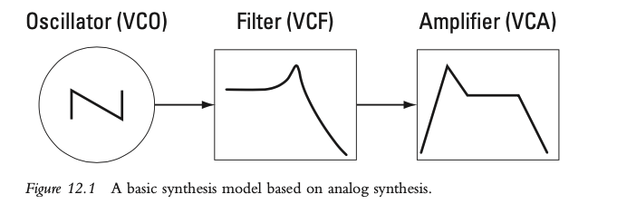
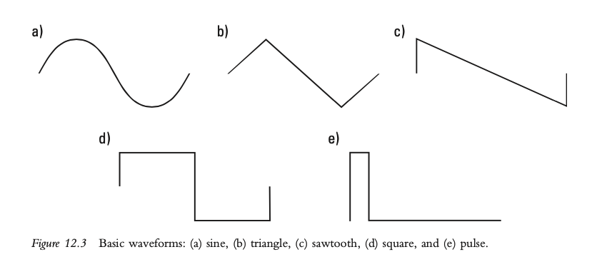
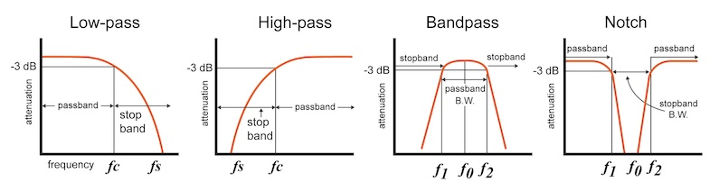
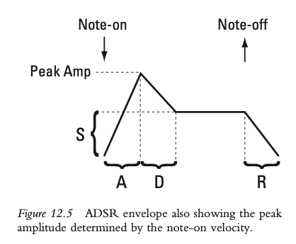
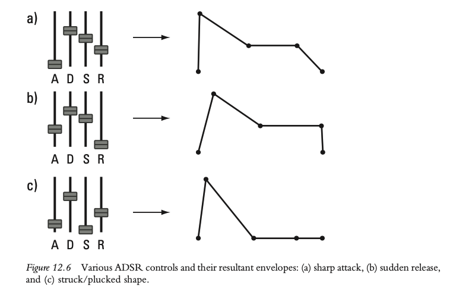

+++
title = "Electronic Sound Production"
outputs = ["Reveal"]
[reveal_hugo]
theme = "solarized"
# show_notes = "separate-page"
+++

# Electronic sound production - synthesis

{}

- Introduction
  - Transition from basics like MIDI editing, sequencing, and sampling to a deeper concept: synthesis.  
- Definition of Synthesis
  - Synthesis is a method that generates sound "from the ground up" through a specific algorithm or recipe.
- Example: Recreating a Trumpet Sound
  - Using software to add together simple sine waves.
  - Match the frequencies, amplitudes, and phases to the partials present in a trumpet sound.
- Types of Synthesis
  - The example above is an instance of additive synthesis.
  - Additive synthesis will be covered in more detail in the next chapter, along with other methods of synthesis.

{}

---

## Analog Days: Synthesizers in the 1960s and 1970s

- Robert Moog, Donald Buchla, and others
  - analog
  - modular
  - voltage controlled

{}

- analog
  - electrical signals in the synths consisted of continuous changes in electrical voltage rather than a discrete series of numbers as in modern digital synthesizers.
- modular
  - the task of generating sound was distributed among separate hardware units called modules.
  - oscillators, filters, and amplifiers were separate modules.
- voltage controlled
  - keyboards, joysticks, and ribbon controllers were used to send control voltages to the modules to change their settings.
{}

---

## Moog - show by Wendy Carlos

<iframe width="560" height="315" src="https://www.youtube.com/embed/4SBDH5uhs4Q" title="YouTube video player" frameborder="0" allow="accelerometer; autoplay; clipboard-write; encrypted-media; gyroscope; picture-in-picture" allowfullscreen></iframe>

---

## Buchla 200e

<iframe width="560" height="315" src="https://www.youtube.com/embed/Y7nxZdkqWpk" title="YouTube video player" frameborder="0" allow="accelerometer; autoplay; clipboard-write; encrypted-media; gyroscope; picture-in-picture" allowfullscreen></iframe>

---

## Yamaha DX7

<iframe width="560" height="315" src="https://www.youtube.com/embed/Q1Ha0MMT0aA?start=165" title="YouTube video player" frameborder="0" allow="accelerometer; autoplay; clipboard-write; encrypted-media; gyroscope; picture-in-picture" allowfullscreen></iframe>

{}
Yamaha DX7, an early all-digital, MIDI-compatible keyboard synthesizer (1983). At about $2,000, the DX7 was relatively inexpensive by early 1980s’ standards.

{}

---

## Basic synthesis model

{}
### Three Core Modules in Synthesis

- **Oscillator**
  - Provides a basic waveform, which determines the timbre.
  - Sets the frequency, affecting the pitch of the sound.

- **Filter**
  - Alters the spectrum or timbre of the basic waveform.
  - Can remove or boost certain frequency components.

- **Amplifier**
  - Applies an envelope to control the amplitude of the audio.
  - Affects loudness and articulation of the sound.

### Analogue Modeling Synthesis in DAWs

- **Not Actual Analogue Synthesis**
  - In Digital Audio Workstations (DAWs), the process is not true analogue synthesis but a digital emulation known as analogue modeling synthesis.

- **Voltage Control (V)**
  - The "V" often seen in module names stands for voltage control.
  - This is a nod to historical modules that were controlled by electrical voltage.

{}

---

# Pitch and timbre source: the oscillator

[Learning Synths - Oscillators](https://learningsynths.ableton.com/en/oscillators/how-synths-make-sound)

---

## Basic Waveforms

{}

### Oscillator in Synthesis

- **Primary Function**
  - Generates a waveform at a specific frequency.
  
- **Cycle Repetition**
  - Takes one cycle of a waveform and repeats it based on the MIDI key number.

### Fixed Waveform or Wavetable Synthesis

- **Definition**
  - A form of synthesis where a fixed waveform is used and repeated.
  
- **Simplicity**
  - When used alone, it is considered the most basic form of synthesis.

{}

---

## Noise

{}

### Importance of Noise in Timbre

- **Significance**
  - Noise serves as a crucial element for creating timbre in synthesized sounds.

### Applications of Noise

- **Percussive Synthesis**
  - Commonly used to generate percussive sounds like cymbals, snare drums, etc.
  
- **Filtered Noise**
  - When noise is filtered, it can emulate natural sounds like wind.
  
- **Electronic Dance Music (EDM)**
  - Used for creating rising effects or sweeps that are common in EDM tracks.

{}

---

## Timbre modification: the filter

[Learning Synths - Fitlers](https://learningsynths.ableton.com/en/filters/filters-in-the-real-world)

{}

### Filters in Mixing vs Synthesis

- **In Mixing (Equalization)**
  - Filters, often referred to as equalization, have a subtle effect on the sound.

- **In Sound Synthesis**
  - Filters produce much more drastic and noticeable changes to the sound.

### Common Types of Filters: Low Pass Filter

- **Low Pass Filter**
  - Widely used in synthesis.
  - Creates the familiar DJ sweep sound.
  
### Key Parameters in Filters

- **Cutoff Frequency**
  - Determines the point in the frequency spectrum where partials start to be reduced in amplitude.

- **Resonance**
  - Boosts the amplitude of the partials at the cutoff frequency.
  - Adds a unique timbral effect to the sound.

{}

---

# Loudness modification: the amplifier

{}

### Role of the Amplifier

- **Third Component in Synthesis Chain**
  - Follows the oscillator and the filter in the signal path.

- **Not Just On/Off**
  - Unlike simply turning the oscillator on and off, the amplifier shapes the sound.

### Amplitude Envelope

- **Purpose**
  - The amplifier uses an amplitude envelope to shape the loudness and articulation of the sound over time.

{}

---

## Applying articulation with an envelope

[Learning Synths - Envelopes](https://learningsynths.ableton.com/en/envelopes/change-over-time)

{}

### Role of Envelope Generators

- **Functionality**
  - Envelope generators in synthesizers allow the amplifier to both set the maximum amplitude and shape the amplitude over the duration of a note.

### ADSR Parameters

- **Attack Time**
  - The duration it takes for the sound's amplitude to reach its maximum value.

- **Decay Time**
  - The time needed for the amplitude to drop to the sustain level.

- **Sustain Level**
  - The amplitude level that is maintained after the decay phase.
  - This level is held as long as the note is sustained.

- **Release Time**
  - Triggered by a 'note-off' message.
  - The duration it takes for the amplitude to drop to its minimum value.

{}

---

---

Experiment with the [Synth Playground](https://learningsynths.ableton.com/en/playground)
