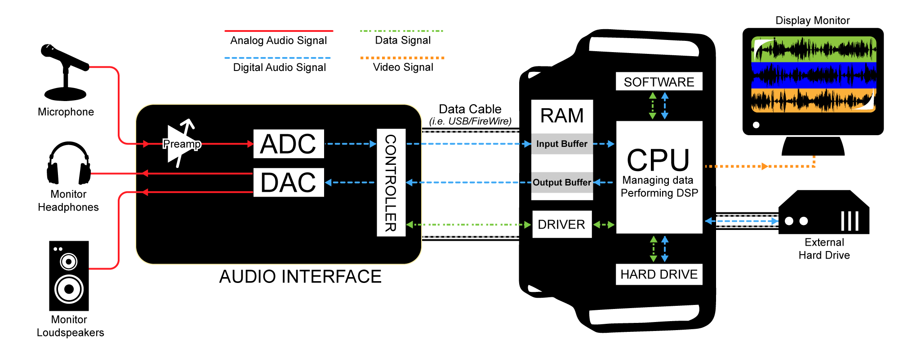
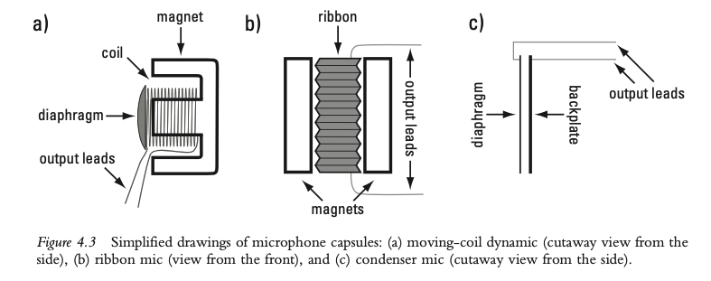
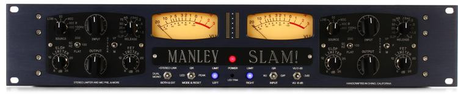
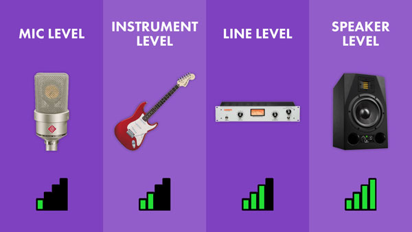
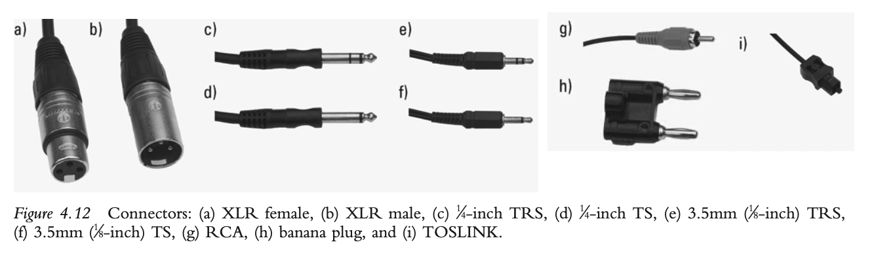
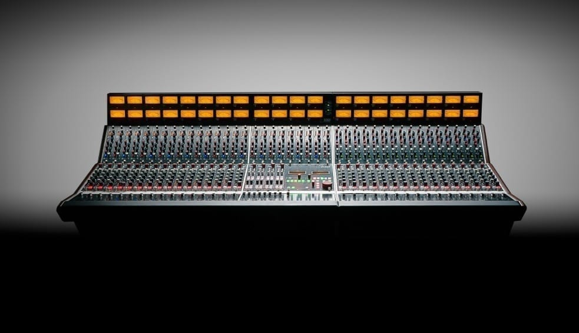
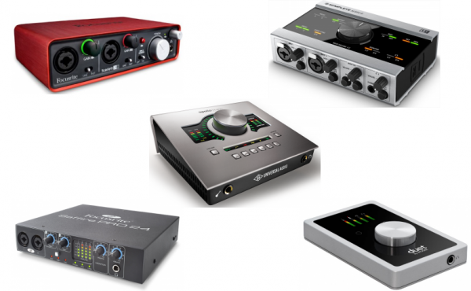
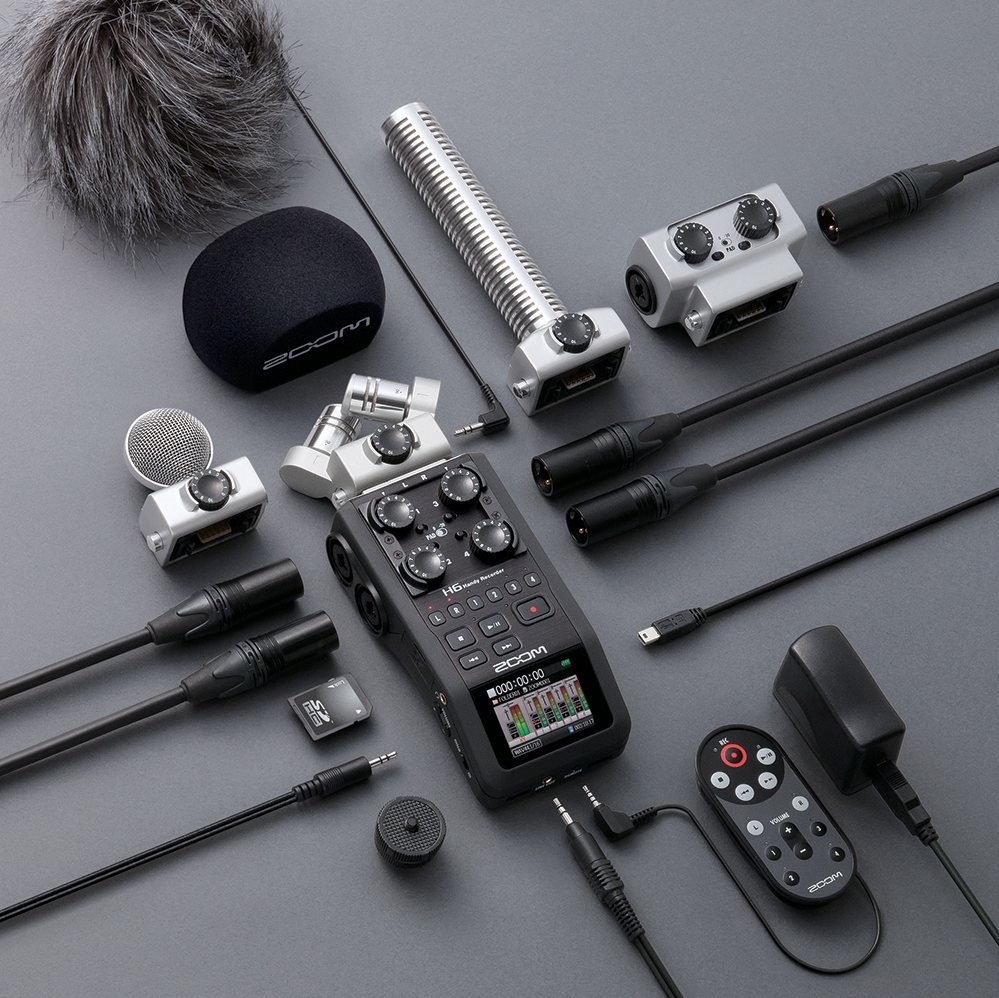
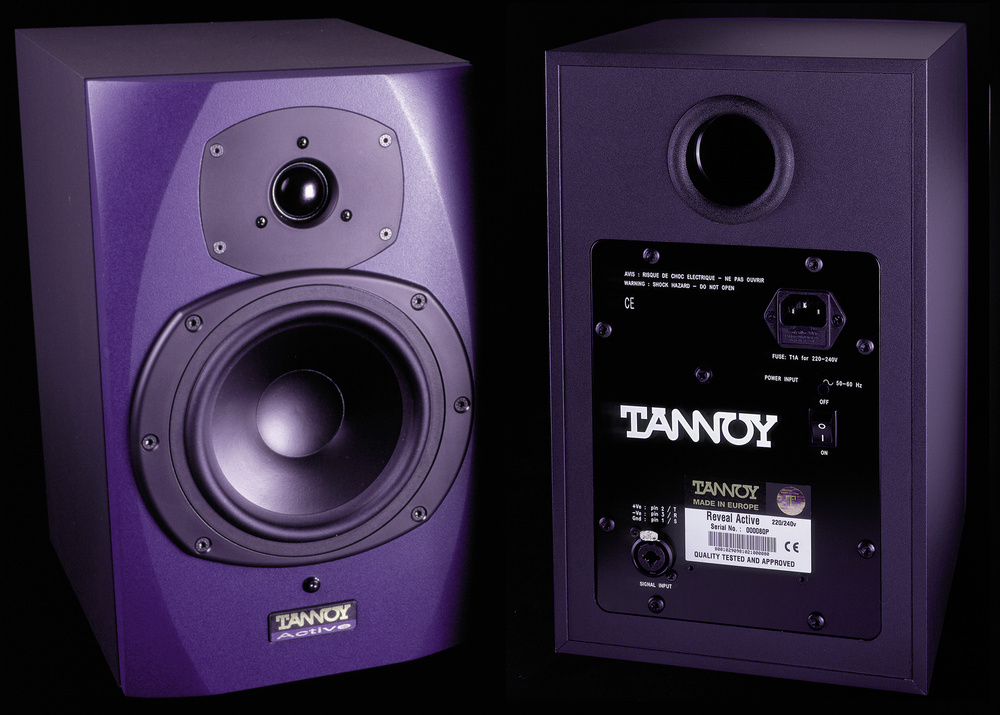

+++
title = "Audio Hardware"
outputs = ["Reveal"]
[reveal_hugo]
theme = "solarized"
# show_notes = "separate-page"
+++

# Audio Hardware

{}
What is audio, and how is it different from sound?

Today we'll cover:

- the audio recording path from analog acoustic vibrations to digital audio and back;
- microphones and preamps, including microphone types and pickup (polar) patterns;
- signal levels, including mic, instrument, and line levels; balanced versus unbalanced
  connections; and various connector types;
- mixers, including a look at the specifications for a simple mixer;
- control surfaces for manipulating parameters in audio software;
- digital audio interfaces, including a look at the specifications for a basic interface;
- portable recorders and their basic specifications;
- amplifiers and speakers, including power amps, passive monitors, and active monitors.

{}

---

## The audio recording path

Source: [Digital Sound and Music](http://digitalsoundandmusic.com/5-1-4-signal-path-in-an-audio-recording-system/)

{}

The first step in our process is to capture sound. We can do this to an analog form, but typically nowadays we use digital audio.

1. Vibrations in the air are converted to an analog electrical signal by a microphone.
2. The microphone signal is increased by a preamplifier.
3. The preamplifier signal is converted to a digital signal by an ADC.
   - ADCs are all around us like your cellphone or computer.
4. The digital signal is stored, edited, processed, mixed, and mastered in software (more
   on this stage in Chapter 6, “Digital Audio Software”).
5. The digital signal is played back and converted to an analog electrical signal by a DAC.
6. The analog electrical signal is made larger by an amplifier.
7. The output of the amplifier is converted into vibrations in the air by a loudspeaker.

{}

---

# Microphones and preamps

{}

Microphones are the beginning of the audio recording path. This makes them very important, garbage in, garbage out. They can range greatly in cost from $20 to thousands of dollars. Microphones are divided into two types, dynamic, condenser.

{}

---

## Microphone diagrams

{}
Open up the Charm city studios microphone presentation.

Dynamic

One common type of dynamic microphone uses a diaphragm attached to a coil that is suspended near a magnet (see Figures 4.3a and 4.4). The coil consists of some fine wire wrapped in a cylindrical fashion. The diaphragm, coil, and magnet make up the microphone’s capsule. You can change the capsule in some microphones to achieve different frequency responses or pickup patterns.

The diaphragm acts like an eardrum, when it moves back and forth it generates an electrical signal that converts sound waves into electricity.

Dynamic microphones are inexpensive and best for live sound reinforcement, but can also be used to record guitar amps, drums and vocals.

Ribbon

Another, less common, form of dynamic microphone is the ribbon microphone, which consists of a thin piece of corrugated, conductive metal—the ribbon—placed between two magnets (see Figure 4.3b). When sound waves hit the ribbon, it moves within the magnetic field, creating a small electrical current in the ribbon.

Condenser microphones also use a diaphragm that vibrates back and forth when sound waves hit it. However, in this case, the diaphragm is metal-coated and suspended in proximity to another metal plate (see Figures 4.3c and 4.5).

Condenser microphones are used frequently in studio settings and for recording live performances. They are more sensitive than dynamic mics and tend to reproduce the total frequency range more fully, due in part to the fact that the moving element, the diaphragm, is lighter than the diaphragm-coil unit of a moving-coil dynamic mic. Many condenser mics are more delicate and more expensive than moving-coil dynamic mics, though there are a number of robust, inexpensive condenser microphones available now.

{}

---

## Microphone polar patterns

[Link to slides](https://docs.google.com/presentation/d/130uChoUPV370sMNJEc02n41QXdygYUO5zVqAWKoa900/present#slide=id.p26)

---

## Preamps

{}
Microphones output a relatively small electrical signal. In order for this signal to be useful, it first needs to be amplified. The component that takes care of this is called a preamplifier, or preamp (see also page 52). Preamps can be standalone devices or built in to a mixer or audio interface.

Just as microphone quality is a critical factor in the proper conversion of acoustic energy into electrical energy, so is preamp quality an important factor in the boosting of this electrical signal without changing its properties. A poor preamp will introduce an unwanted “color” to the sound.

{}

---

# Signal levels

Source: [BlackGhostAudio](https://www.blackghostaudio.com/blog/audio-signal-levels-explained-mic-instrument-line-and-speaker)

{}

The electrical signals to and from these devices are transmitted at various signal levels and may require different cables and connectors to integrate them into the recording path. In addition, some sound sources output digital signals that can be connected to digital inputs on an audio interface or digital mixing board.

In general, microphones produce a small electrical signal that is sent out as a balanced signal down a cable that has XLR connectors (also called Canon connectors). This cable is then connected to a preamp.

Devices such as synthesizers, audio processing gear, and mic preamps output line level signals, which are higher than mic level signals. Line level signals can be plugged directly into the line level inputs of an audio interface or mixing board. Typically uses XLR or TRS connectors.

Another common electrical signal level is the instrument level, which is associated most often with the output level of a guitar or bass guitar. The output of a guitar or bass guitar is an unbalanced signal carried on a cable with 1⁄4-inch TS connectors (see Figure 4.12d). As noted above, unbalanced signals are more susceptible to interference than balanced signals, so the cables should be kept relatively short.

The output of a power amplifier that is sent to a passive speaker (see “Amplifiers and Speakers” on pages 69–70) is referred to as speaker level, and is higher than any of the other levels discussed in both voltage and power. Typically, speaker level signals don’t interact with the other signals in the recording chain—they are designed only to be sent to speakers—and plugging them into other equipment can cause damage. Speaker cables often use bare, relatively heavy gauge stranded wires that connect to screw terminals or clamps. Speaker wires may also use banana plug connectors (see Figure 4.12h).

{}

---

## Cable connector types

---

## Mixers

{}

The mixer brings all audio signals together and allows us to balance these signals. We can then independently change the levels of the signal. We can also pan, EQ, and route the signal to other processing devices. Mixers can be analog or digital and also exist as software. Many home studios don't need mixers because tracks are recorded one at a time and mixed "in the box".

{}

---

## Simple mixer

- input jack/controls
- Aux send knobs
- Three-band equalizer
- Pan knob
- Mute button
- Solo button
- Gain knob/fader

[Mackie 802VLZ4 Manual](https://mackie.com/img/file_resources/802VLZ4_OM.pdf)

---

## Digital Audio Interfaces

{}

For audio recording and playback, the ADC and DAC form the core of the digital audio interface. We could just use the computers headphone jack, but a digital audio interface is much more versatile and better quality.

- analog inputs, trim knob, phantom power switch, pad switch
- analog outputs - go to your speakers or headphones
- digital input/outputs
- MIDI input/outputs
- Computer connection - most important part, transfers audio signals to computer

{}

---

## Portable recorders

---

## Amplifiers and speakers

{}
once the digital audio has been converted into an analog electrical signal, the next steps before hearing it are to amplify the electrical signal and then convert it into a series of vibrations in the air.

Speaker cone -> driver

Sort of like a backwards microphone.

Active monitors have amplifiers built in.

Passive monitors require amplifiers to power them.

{}

---

## Speaker cone

