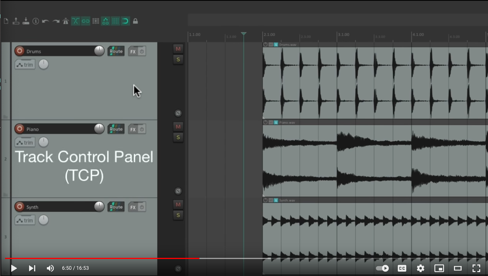

+++
title = "Reaper intro"
outputs = ["Reveal"]
[reveal_hugo]
theme = "blood"
margin = 0.2
separator = "##"
+++

## What is Reaper?
Reaper is a digital audio workstation (DAW) known for its flexibility and customizability. Unlike other DAWs like Pro Tools, Logic Pro, or Ableton Live, Reaper allows you to customize nearly every aspect of its interface, including key commands, menus, toolbars, and mouse behaviors.

{}

One of the most unique features of Reaper compared to other DAWs, such as Pro Tools, Logic Pro, or Ableton Live, is that everything is customizable, including key commands, menus, toolbars, and mouse behaviors. Reaper has reasonable defaults, so you don't have to worry about customizing everything immediately.
{}

---

## Main View

We can hide the mixer by closing it (cmd+M).

---

## Track Management

* **Delete Tracks:** Select the track and hit delete on your computer keyboard.
* **Create New Tracks:** Double-click in the track pane.

<video src="create-tracks.mov" loop autoplay muted controls width=725>

---

## Tracks in Reaper
- There are no specific track types in Reaper. Tracks can include audio, MIDI, or video items, or even multiples on the same track.
- Tracks can also become folders containing many tracks.

### Try This:
> Create a track with multiple types of media, then create a folder with many tracks. 

---
## Timeline Customization
> Right-click on your timeline to change its units.

<video src="timeline.mov" loop autoplay muted controls width=725>

---

## You Try 

> Find a few random sounds from [freesound.org](https://freesound.org) and import them. Notice how the track name changes to match the item name. As you drag in clips, notice how the items snap to the grid. If this doesn't happen, make sure you have snapping turned on.

---

# Working with Items

* **Items or Media Items:** In Reaper, audio files are referred to as Items or Media Items.
* **Copy, Paste, and Move:** Items can be copied, pasted, and moved around freely.
* **Trimming:** Use your mouse cursor to trim the beginning and end of the tracks.
* **Multi-File Trim:** Select multiple files and trim them all at once.

---

## Looping and Fading
* **Looping:** Drag an item to the right to start looping.
* **Fades:** Add fade-ins and fade-outs by hovering over the top corner of the items. You can also apply fades to all selected tracks.
* **Zooming:**
  * **Vertical:** Use your mouse wheel to zoom in and out of items vertically.
  * **Horizontal:** Use the modifier `Cmd` and your mouse wheel to zoom horizontally.
* **Contextual Menu:** Right-click the items to see a contextual menu with more options.

---

## Track Control Panel (TCP)

* The TCP gives you access to each track's volume, mute, solo, pan, and other parameters.

---
## Track Context Menu

* **Right-Click:** Right-click the track to access a contextual menu with more options.

<video src="context-menu.mov" loop autoplay muted controls width=725>

---

## The Mixer Pane

* **Opening the Mixer Pane:** Open the mixer pane to view all track levels.
* **Rearrange the Mixer:** The mixer window can be rearranged to another part of the screen or floated.

<video src="mixer-move.mov" loop autoplay muted controls width=725>

---

## Adjusting Project Tempo

* **Change BPM:** Adjust the BPM of the project from the tempo menu on the bottom right of the screen (the transport).

<video src="tempo.mov" loop autoplay muted controls width=725>

---

## Adjusting Track Heights and Widths

* **Track Heights:** Adjust the track heights or widths as needed.

<video src="track-height.mov" loop autoplay muted controls width=725>

---

## Exploring Reaper Themes

<iframe src="https://blog.landr.com/10-best-reaper-themes/" width=900 height=900></iframe>

---

## Actions in Reaper

* **Actions Menu:** Control almost anything in Reaper with Actions. View the actions menu (`shift + ?`).

<video src="actions.mov" loop autoplay muted controls width=725>

---

## Additional Resources

* **Reaper User Guide:** [Reaper User Guide](https://www.reaper.fm/userguide.php)
* **Online Tutorials:** Explore Reaper tutorials on YouTube and other platforms.
  * [REAPER Mania - YouTube](https://www.youtube.com/@REAPERMania)
* **Community Forums:** Join the Reaper community forums for tips and support.
  * [REAPER Forums - Cockos Incorporated Forums](https://forum.cockos.com/forumdisplay.php?f=20)
