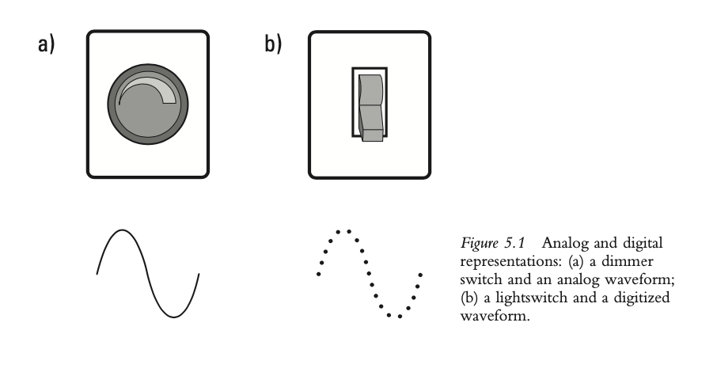
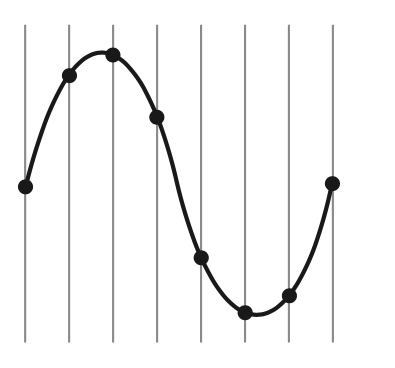
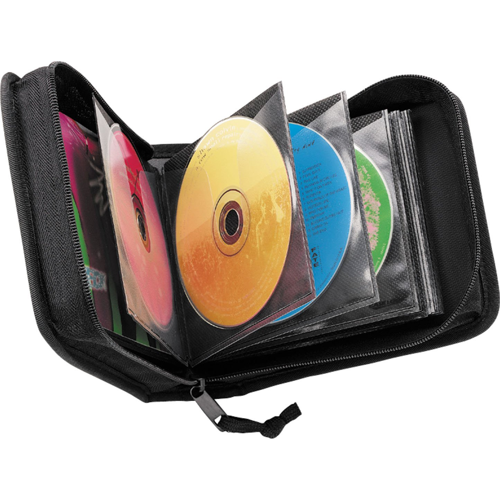
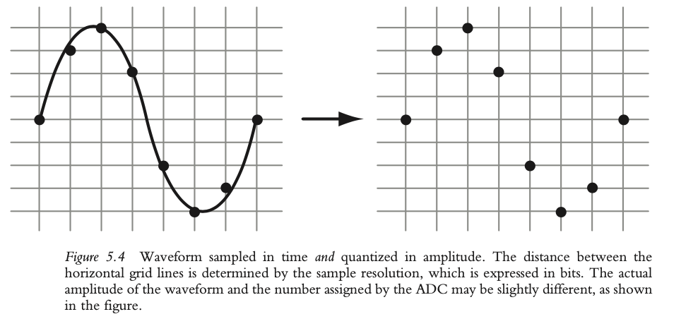
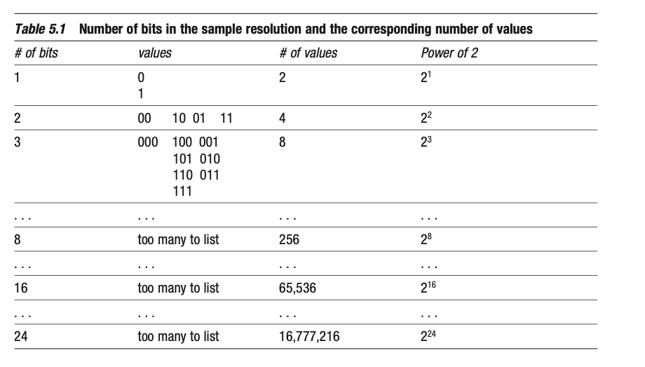

+++
title = "Digital Audio Data"
outputs = ["Reveal"]
[reveal_hugo]
theme = "solarized"
# show_notes = "separate-page"
+++

## Digital Audio Data 

{}
What happens in the ADC and DAC? This is the process of digitization. Analog and digital signals are totally different ways of representing sound. 

We can think of digital like a light switch, its either on or off, where analog is a continuous signal without discrete states. 

{}

---

## Sampling 

{}
* To convert a continuous analog signal into a series of numbers the ADC takes samples of the acoustic signal 
* we measure the amplitude of the incoming waveform some amount of time per second; this is a frequency so is measured in Hertz; similarly to cycles per second of a tone 
* this frequency of sampling is known as the sampling rate
* quantization is the process of assigning an amplitude to the sample
* sample resolution is the number of amplitude values available to the ADC

{{/note %}}

---

## Sampling Rate

<!--  -->

{}
CD-quality audio is 44.1 kHz, this is the most common sampling rate. What this means is that the ACD measures the amplitude of the incoming waveform 44,100 times per second for each audio channel.

We have to remember that this process of sampling is always ignoring data coming in, but it is ok because 44.1 K is high enough to capture the most important information in the audio signal.

{{/note %}}

---

## Nyquist Frenquency

Nyquist frequency = 1⁄2 × Sampling rate

Nyquist frequency = 1⁄2 × 44,100 Hz = 22,050 Hz = 22.05 kHz

{}
We can't represent frequencies higher than one half of the sampling rate. This frequency cutoff is called the Nyquist frequency. Here we can see the sampling theorem, developed by Harry Nyquist.

These frequencies are actually filtered out of the signal in the recording process. This is OK because the frequencies we have lost are out of our range of hearing. 

Higher sampling rates are often used during recording to reduce the noise in the signal. They are later downsampled to 44.1kHz. 

* 48 kHz is common for DVD format
  

{{/note %}}

---

## Other sample rates 

* 48 kHz - DVD format
* 96 kHz
* 192 kHz

{}

Higher sampling rates are often used during recording to reduce the noise in the signal. They are later downsampled to 44.1kHz. 

Some people think that recording at higher sampling rates is a waste of time. Its a  bit of an argument in the field of audio.

{{/note %}}

---

## Quantization and sample resolution

{}

Now lets focus on the y axis, which is the amplitude of the signal.

The ADC measures the incoming analog electrical waveform 44,100 times per second, or more for higher sampling rates. Each time the ADC performs this measurement, it must assign a numerical value to that sample’s amplitude. This assignment of a specific value to the measured amplitude is referred to as quantizing. Don't get this quantizing confused with quantizing of MIDI data.

This is also known as bit depth, not to be confused with "bit rate", which we will talk about at another time. 

{{/note %}}

---

## Bit depths 

{}

16 bits is CD quality audio.

24 bits is common when recording. Higher bit depths are used to allow for a greater dynamic range. 

{{/note %}}

---

## Digital Audio File Formats

* Compressed
   * AIFF - .aiff
   * WAVE - .wav
   * Apple's core audio format - .caf

{}

Once we convert to digital, how is it stored?

In uncompressed file formats, digital audio is stored as a series of 16- or 24-bit amplitude values or as 32-bit floating-point amplitude values—32-bit floating-point values are used for internal calculations within most audio recording software, but recording (ADC) and playback (DAC) are done with 16 or 24 bits. Chunks of data written at the beginning of the file indicate information such as the sampling rate, the resolution, the number of channels (two for stereo, six for 5.1 surround, etc.), and the length of the file. Some formats include other information as well, such as loop points for use by hardware or software samplers. Digital audio that is used by audio editing/processing/mixing software is stored in an uncompressed file format.

{{/note %}}

---

## 44.1 kHz, 16-bit, stereo

44,100 samples/second × 2 bytes/sample = 88,200 bytes/second ≈ 90 kB/second 

90 kB/second × 60 seconds/minute = 5,400 kB/minute ≈ 5 MB/minute

5 MB/minute × 2 channels (left and right) = 10 MB/minute

---

## Compressed 

* Lossless
   * mp4
   * Ogg 
   * Free Lossless Audio Codec -  .flac 
* Lossy 
    *  mp3
    *  mp4 with AAC 

{}
Lossless compression reduces the size of audio files in such a way that the original data can be perfectly recovered. An example of lossless compression from the non-audio world is the .zip file, in which all the data from the zipped files can be fully recovered.

Lossy compression, on the other hand, reduces audio file sizes by permanently and unrecoverably eliminating some of the audio information. Lossy compression typically achieves far greater reduction in audio file sizes than lossless compression.

Most lossy compression schemes utilize perceptual encoding to achieve file size reduction without a substantial loss in quality. 

The term “perceptual encoding” encompasses a variety of techniques that use knowledge of the human auditory system to selectively remove elements that we wouldn’t hear anyway. As an example, one of the auditory phenomena utilized by perceptual encoders is frequency masking.
{{/note %}}